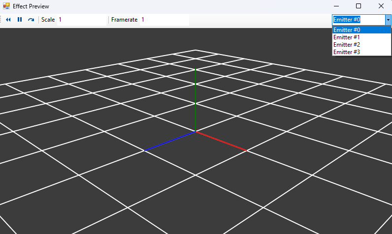
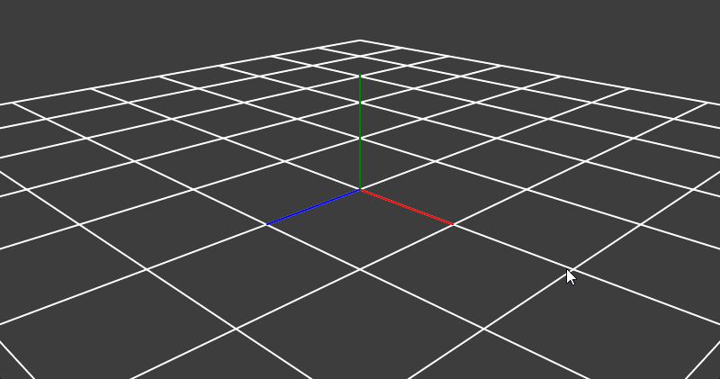
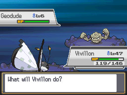
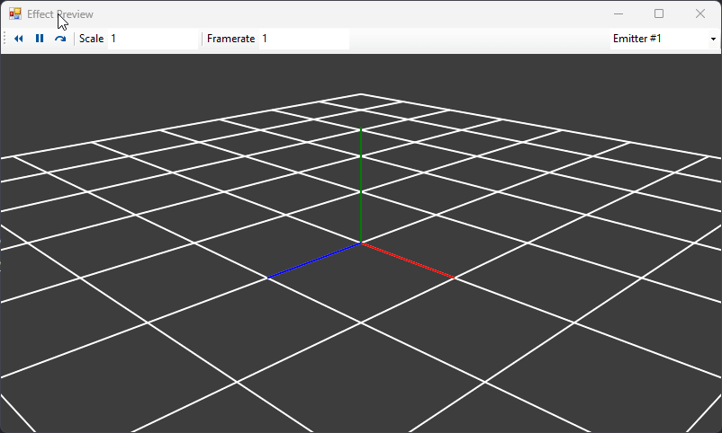
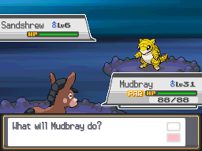

# Move Animation Scripting System Documentation
Moves in Heart Gold have 2 of their own bytecode scripting languages that correspond with certain pieces of code that would have to be repeated constantly across moves.  This is similar in function to the various scripting systems from Gen 3 as well.

Move animations have their own, just like battle scripts, overworld scripts, 

Move animation scripts are often called within battle scripts to show something happening, be it the Pokémon sliding around or small particles coming up to show that the Pokémon is honing its claws.  In addition to this, every single move has its own animation that is played when the move is used.  There are two classes of these, and admittedly I'm not too sure when the latter is used, but they are dumped in this repo for completeness and future-proofing:
- ``move_anim``
- ``move_sub_anim``

## ``move_anim`` - a010
Every move has its own animation in this file, and they are performed by these scripts using the .SPA particle files from a029.  We currently just steal them from the Gen 5 games and see if they work in Heart Gold well enough.  Most ``move_anim`` scripts just load a particle file (the .SPA handles most of the movement of said particle), place particles from the file, and play a sound.

## ``move_sub_anim`` - a061
I believe this is used intermittently for when an animation needs to happen and there isn't a move slot that has the animation already defined.  I haven't looked too much into this as of yet, but things like Thief's animation for stealing an item (as opposed to the attack animation) and Pokémon using an item to heal are probably in this narc.

This documentation is inherently aiming to be less thorough than the similar [[Move Scripting Systems Documentation|Move Scripting Systems Documentation]].  Less is known about move animation scripts, but the bulk of the animation is put on the shoulders of the particle (SPA) files.  These will be shortly covered at the end of the tutorial.  Moves often just place a SPA file, maybe blend the Pokémon with a color, shake it or something similar, and play a sound.

The average move script will look something like this (see [Quiver Dance's animation](https://github.com/BluRosie/hg-engine/blob/main/armips/move/move_anim/486.s))
```
red equ 31
green equ 31
blue equ 31

a010_486:
    loadparticlefromspa 0, 499
    waitparticle

    callfunction 34, 6, 2, 0, 1, red | green << 5 | blue << 10, 10, 15, "NaN", "NaN", "NaN", "NaN"
    callfunction 36, 5, 3, 0, 1, 10, 264, "NaN", "NaN", "NaN", "NaN", "NaN" // shake target mon
    addparticle 0, 2, 3
    addparticle 0, 1, 3
    addparticle 0, 0, 3
    playsepan 1911, -117
    wait 2
    playsepan 1911, -117
    wait 2
    playsepan 1911, -117
    wait 2
    playsepan 1911, -117
    wait 2
    playsepan 1911, -117
    wait 2
    playsepan 1911, -117
    wait 2
    playsepan 1911, -117
    waitparticle

    unloadparticle 0
    waitstate
    end
```
A quick overview on .SPA particles:

Each SPA file is split into emitters.  Each emitter actually handles the particles that come out.  There is a tool called Nitro Effect Maker that makes this very nice to view.  In Quiver Dance, the SPA at file 499 in a029 is loaded to be used for this animation in slot 0.  Opening this in [Nitro Effect Maker](https://wiki.dshack.org/Wiki.jsp?page=List%20of%20Tools#section-List+of+Tools-NitroEffectMaker), we get this:



Each SPA is split into different emitters.  Each emitter can be viewed in the dropdown above.



SPA's are loaded into what I term "particle slots" for the purpose of animation scripts.  Every particle slot filled needs to be unloaded at the end of the script.

Now we dissect the script:

``loadparticlefromspa 0, 499`` loads in SPA 499 into particle slot 0.  This allows us to use its particles with `addparticle` later in the script.  It must be followed by a `waitparticle`, even in [examples where you load multiple at the same time like Synchronoise](https://github.com/BluRosie/hg-engine/blob/main/armips/move/move_anim/488.s).

``loadparticlefromspa`` is really a big macro for the following commands:

<details>
<summary>`loadparticlefromspa` defintion - click to drop down!</summary>
<br>

```
.macro loadparticlefromspa,num0,file
    initspriteresource
    loadspriteresource 0
    loadspriteresource 1
    loadspriteresource 2
    loadspriteresource 3
    loadspritemaybe 4, 0, 0, 0
    loadspritemaybe 5, 0, 1, 1
    loadspritemaybe 6, 0, 2, 2
    loadspritemaybe 7, 0, 3, 3
    callfunction 78, 1, 0, "NaN", "NaN", "NaN", "NaN", "NaN", "NaN", "NaN", "NaN", "NaN"
    loadparticle num0, file
    waitstate
    unloadspriteresource
    resetsprite 0
    resetsprite 1
    resetsprite 2
    resetsprite 3
.endmacro
```

</details>

```
loadparticlefromspa slot, file
loads the "file" from narc a029 into particle slot "slot"
- slot is the particle slot to load the spa into
- file is the subfile of narc a029 to load as an SPA into the slot

waitparticle
wait for a particle load or any particles on screen to finish their animation
```

Scripts from the base game, while included here for completion, will often have these commands split across multiple others and aren't easily reducible to the nice and easy `loadparticlefromspa`.  This makes them a little harder to follow, but not too bad overall if you need them for reference.

A number of things that really should be script commands are subsets of the `callfunction` command with a certain index.  The `callfunction` command operates like so:

```
callfunction func, numargs, arg1, arg2, arg3, arg4, arg5, arg6, arg7, arg8, arg9, arg10
- func is the "index" of the action to do
  - 34 shades a pokemon a certain color
  - 33 flashes the screen a certain color
  - 36 shakes the target mon certain number of times
  - 57 slides the attacking mon some coordinates
  - 68 shakes the screen a number of times
- numargs is the number of arguments to read for that
- arg0-arg10 all depend on numargs
```
These are actually thus defined as helpful script macros.  These will be covered later on, and can be safely replaced with what they define.

For now, Quiver Dance uses `callfunction 34, 6, 2, 0, 1, red | green << 5 | blue << 10, 10, 15, "NaN", "NaN", "NaN", "NaN"` which shades the attacking mon the RGB555 color defined by the components red/green/blue, here 31, 31, 31 which shades the Pokémon white.  The macro that can replace this is `shadeattackingmon red, green, blue`.

`callfunction 36, 5, 3, 0, 1, 10, 264, "NaN", "NaN", "NaN", "NaN", "NaN"` shakes the target Pokémon 3 times with a magnitude of 10.  The macro that can replace this is `shaketargetmon 3, 10`.  Note that Quiver Dance's target is the attacker, so this `callfunction` works just fine.

Now we get to the `addparticle` command.

```
addparticle slot, emitter, origin
adds "emitter" from particle slot "slot" to the battler "origin"
- slot is the particle slot to read from, initialized in the loadparticlefromspa command
- emitter is the emitter to place from the spa that is read, viewable in Nitro Effect Maker
- origin is the area to place the particle that is loaded from the SPA.  while there are a number of options here, the most important ones are:
  - 3 - place the particle at the attacker's position
  - 4 - place the particle at the target's position
```
This will then play the entire animation as defined in the emitter from Nitro Effect Maker.

Here we add all of the emitters 0-2 from particle slot 0 at the attacker's (3's) position.

Then we play the sounds every 2 frames with a pan significantly to the left using `playsepan`.  There is also a `playse` command that doesn't take into account panning from left to right:

```
playse id
plays the sound effect "id"
- id is the sound effect to play

playsepan id, pan
plays the sound effect "id" with "pan" from -127 to 128
- id is the sound effect to play
- pan is the bias across the left/right speakers to play, with the most negative value being far left bias and positive being far right bias
```
The `wait` command tells the script to wait a certain number of frames before doing the next action.
```
wait frames
waits for the specified number of frames
- frames is the amount of frames to pause for
```
After all of the sound effects are played, the `waitparticle` waits for all the currently-in-progress particles to end their animation.

Then the game unloads the particles it loaded at the beginning with `unloadparticle`.  These are always followed with a `waitstate`, even if more particles need to be unloaded yet (once again see [Synchronoise](https://github.com/BluRosie/hg-engine/blob/main/armips/move/move_anim/488.s)).
```
unloadparticle slot
unloads particle loaded into "slot" by loadparticlefromspa
- slot is the particle slot to unload

waitstate
waits for the unloadparticle to fully finish before continuing
```
The script ends with `end`.

This all comes together in a nice animation:



Convenience `callfunction` macros that have been made so far:

```
shadeattackingmon red, green, blue
shades attacking mon RGB555 color
- red is the red component from 0-31
- green is the green component from 0-31
- blue is the blue component from 0-31

shadetargetmon red, green, blue
shades target mon RGB555 color
- red is the red component from 0-31
- green is the green component from 0-31
- blue is the blue component from 0-31

flashscreencolor red, green, blue
flashes the screen RGB555 color
- red is the red component from 0-31
- green is the green component from 0-31
- blue is the blue component from 0-31

shaketargetmon times, magnitude
shakes the target mon "times" number of times for a length of "magnitude"
- times is the number of times to shake the target pokemon
- magnitude is the length to shake the target mon

slideattackingmon x, y
slides attacking mon a change of <x, y> pixels.  a positive y will slide the attacker down and the defender up
- x is the horizontal sliding distance in pixels
- y is the vertical sliding distance in pixels

shakescreen
shakes the screen

rotateattackerincircle
rotates attacker in a circle like rolling kick and agility
```
Covered in this documentation are older scripts that were made before the convenience macros were defined, which is why they aren't used.

Looking at another animation script, this time for [Heavy Slam](https://github.com/BluRosie/hg-engine/blob/main/armips/move/move_anim/487.s):
```
a010_487:
    loadparticlefromspa 0, 500
    waitparticle

// slide mon
    playsepan 1925, -117
    callfunction 57, 4, 4, -16, 8, 258, "NaN", "NaN", "NaN", "NaN", "NaN", "NaN" // slide mon down a little bit
    waitstate
    wait 15
    playsepan 1847, 117
    callfunction 57, 4, 4, 32, -16, 258, "NaN", "NaN", "NaN", "NaN", "NaN", "NaN" // slide mon up forward
    waitstate

// hit + clouds
    playsepanmod 1993, -117, 117, 4, 2
    addparticle 0, 1, 4
    addparticle 0, 0, 4
    callfunction 36, 5, 4, 0, 1, 7, 264, "NaN", "NaN", "NaN", "NaN", "NaN" // shake mon
    callfunction 57, 4, 4, -16, 8, 258, "NaN", "NaN", "NaN", "NaN", "NaN", "NaN" // return mon to original pos
    waitstate
    end

    unloadparticle 0
    waitstate
    end
```
Here, we look at all the same things:

`loadparticlefromspa` loads SPA 500 into particle slot 0.  We see from the `addparticle` commands later on that the emitters 1 and 0 are used, and place the particles at the target's position:



A new command here is `playsepanmod`:

```
playsepanmod id, panstart, panend, panadd, time
plays sound effect "id" starting at pan "panstart" moving to "panend" in steps of "panadd" every time period "time" in frames
- id is the sound effect id to play
- panstart is the pan to start at
- panend is the pan to end at
- panadd is the step size
- time is the step time
```
Running through the script again and replacing each `callfunction` with its convenience macro:
```
a010_487:
    loadparticlefromspa 0, 500
    waitparticle

// slide mon
    playsepan 1925, -117
    slideattackingmon -16, 8
    waitstate
    wait 15
    playsepan 1847, 117
    slideattackingmon 32, -16
    waitstate

// hit + clouds
    playsepanmod 1993, -117, 117, 4, 2
    addparticle 0, 1, 4
    addparticle 0, 0, 4
    shaketargetmon 4, 7 // 4 times magnitude 7
    slideattackingmon -16, 8
    waitstate

    unloadparticle 0
    waitstate
    end
```
`loadparticlefromspa` loads SPA 500 into particle slot 0.  `waitparticle` pauses until that is done.

Sound effect 1925 is played so our left ear hears it.  The Pokémon is slid to its left 16 pixels and down 8 pixels, which is followed by a `waitstate` to wait for the slide to complete.

It stays down here an additional half second before playing sound effect 1847 in the right ear and sliding the attacking mon to its right 32 and forward 16 pixels.  Another `waitstate`.

The sound effect 1993 is played from -117 to 117 in steps of 4 every 2 frames.  At the same time, emitters 0 and 1 are placed at the target's position, and a target shake of magnitude 7 for 4 times is initiated.  Also at the same time, the attacking Pokémon returns to its original position.  `waitstate`.

Particle slot 0 is unloaded, and the script ends.



## Editing SPA Files

working on it
