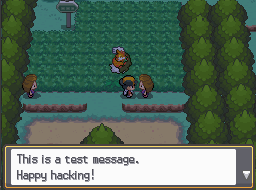

## Trainer Pokémon Structure Documentation

Trainers have both a data entry that specifies details about the trainer itself and a file that details the party that they have.  This page will detail the structure of the file that the party takes.

Trainers also have a table that defines the text printed at various points in interacting with them, from the overworld to during battles.  This is covered at the end.

The vanilla fully-featured trainer mon structure:

```c
typedef	struct
{
    u8 ivs;
    u8 abilityslot;
    u16 level;
    u16 monsno;
    u16 itemno;
    u16 moves[4];
    u16 ballseal;
} __attribute__((packed)) FULL_TRAINER_MON_DATA_STRUCTURE;
```

This is very limited, doesn't allow for much variance, and sets trainers at an inherent disadvantage when compared to the player, who can gain EV's and thus increase their own stats.  

- ``ivs`` is a value 0-255 that is scaled from 0-31 that is then used for the IV's for all of the stats of that specific entry.
- ``abilityslot`` seems to be somewhat used to influence the PID of the mon when looking to force the gender of the mon one way or the other, but otherwise the lsb is the only one that matters, toggling the ability.
- ``level`` is the level of the mon.
- ``monsno`` is the species of the mon.  This is technically ``(form << 10) | species``*.
- ``itemno`` is conditionally read depending on the trainer data ``data_type`` having the flag ``TRAINER_DATA_TYPE_ITEMS`` set.  This is the held item of the mon.
- ``moves[]`` are conditionally read depending on the trainer data ``data_type`` having the flag ``TRAINER_DATA_TYPE_MOVES`` set.  These are the moves that the mon can use in battle.
- ``ballseal`` determines the ball seal that appears when the mon is sent out.  It is not conditionally read, and the game needs it to appear at the end of the structure (for whatever reason).

*Trainer Pokémon in the vanilla games technically support form definitions, but will not update base stats if a form is read from the structure.

hg-engine expands upon this structure significantly, allowing for much more flexible Pokémon and competitive sets in addition to adding various customization features that allow trainers to have personality in the game or be influenced by events.
```c
typedef	struct
{
    u8 ivs;
    u8 abilityslot;
    u16 level;
    u16 monsno;
    u16 itemno;
    u16 moves[4];
    u16 ability;
    u16 ball;
    u8 ivnums[6];
    u8 evnums[6];
    u8 nature;
    u8 shinylock;
    u32 additionalflags;
    u32 status;
    u16 hp;
    u16 atk;
    u16 def;
    u16 speed;
    u16 spatk;
    u16 spdef;
    u8 types[2];
    u8 ppcounts[4];
    u16 nickname[11];
    u16 ballseal;
} __attribute__((packed)) FULL_TRAINER_MON_DATA_STRUCTURE;
```

To maintain compatibility with the original structure, much of the original fields are yet present despite being overwritten by later fields if the trainer data ``data_type`` calls for it:
- ``ivs`` is a value 0-255 that is scaled from 0-31 that is then used for the IV's for all of the stats of that specific entry.
- ``abilityslot`` seems to be somewhat used to influence the PID of the mon when looking to force the gender of the mon one way or the other, but otherwise the lsb is the only one that matters, toggling the ability.  Under hg-engine, setting ``abilityslot`` to ``2`` will have the hidden ability activate.  ``abilityslot`` influencing the nature can then be reimplemented under the ``nature`` field.
- ``level`` is the level of the mon.
- ``monsno`` is the species of the mon.  This is now technically ``(form << 11) | species``**.
- ``itemno`` is conditionally read depending on the trainer data ``data_type`` having the flag ``TRAINER_DATA_TYPE_ITEMS`` set.  This is the held item of the mon.
- ``moves[]`` are conditionally read depending on the trainer data ``data_type`` having the flag ``TRAINER_DATA_TYPE_MOVES`` set.  These are the moves that the mon can use in battle.
- ``ballseal`` determines the ball seal that appears when the mon is sent out.  It is not conditionally read, and the game needs it to appear at the end of the structure (for whatever reason).

** Forms now update base stats/ability when specified

New fields added:
- ``ability`` is conditionally read depending on the trainer data ``data_type`` having the flag ``TRAINER_DATA_TYPE_ABILITY`` set.  This is the ability that the Pokémon will have--no integrity checks are made.  Takes precedence over the ``abilityslot`` field.
- ``ball``  is conditionally read depending on the trainer data ``data_type`` having the flag ``TRAINER_DATA_TYPE_BALL`` set.  This is the Poké Ball that the mon is sent out in (the Item ID specifically).
- ``ivnums[]`` is conditionally read depending on the trainer data ``data_type`` having the flag ``TRAINER_DATA_TYPE_IV_EV_SET`` set.  These are the IV's that the mon will have, a value 0-31.  Takes precedence over the ``ivs`` field.
- ``evnums[]`` is conditionally read depending on the trainer data ``data_type`` having the flag ``TRAINER_DATA_TYPE_IV_EV_SET`` set.  These are the EV's that the mon will have, values 0-255 each.  No integrity checks are made (i.e. you can supercharge each mon).
- ``nature`` is conditionally read depending on the trainer data ``data_type`` having the flag ``TRAINER_DATA_TYPE_NATURE_SET`` set.  A value 0-24 that matches up with the defines in armips/include/constants.s
- ``shinylock`` is conditionally read depending on the trainer data ``data_type`` having the flag ``TRAINER_DATA_TYPE_SHINY_LOCK`` set.  A value 0 or 1 that determines whether or not the mon will be shiny.  Note that this is for the trainer ID that the trainer has, so catching it with a cheat will not retain its shininess.
- ``additionalflags`` is conditionally read depending on the trainer data ``data_type`` having the flag ``TRAINER_DATA_TYPE_ADDITIONAL_FLAGS`` set.  This field actually is necessitated by the trainer data ``data_type`` field only having 8 bits.
- ``status`` is conditionally read depending on the mon data ``additionalflags`` having the flag ``TRAINER_DATA_EXTRA_TYPE_STATUS`` set.  This will set the mon's status to something before it is even sent out (i.e. pre-paralyzed).
- ``hp`` is conditionally read depending on the mon data ``additionalflags`` having the flag ``TRAINER_DATA_EXTRA_TYPE_HP`` set.  This will set the HP and HP Max stats to this value instead of calculating it.
- ``atk`` is conditionally read depending on the mon data ``additionalflags`` having the flag ``TRAINER_DATA_EXTRA_TYPE_ATK`` set.  This will set the Attack stat to this value instead of calculating it.
- ``def`` is conditionally read depending on the mon data ``additionalflags`` having the flag ``TRAINER_DATA_EXTRA_TYPE_DEF`` set.  This will set the Defense stat to this value instead of calculating it.
- ``speed`` is conditionally read depending on the mon data ``additionalflags`` having the flag ``TRAINER_DATA_EXTRA_TYPE_SPEED`` set.  This will set the Speed stat to this value instead of calculating it.
- ``spatk`` is conditionally read depending on the mon data ``additionalflags`` having the flag ``TRAINER_DATA_EXTRA_TYPE_SP_ATK`` set.  This will set the Special Attack stat to this value instead of calculating it.
- ``spdef`` is conditionally read depending on the mon data ``additionalflags`` having the flag ``TRAINER_DATA_EXTRA_TYPE_SP_DEF`` set.  This will set the Special Defense stat to this value instead of calculating it.
- ``types[]`` is conditionally read depending on the mon data ``additionalflags`` having the flag ``TRAINER_DATA_EXTRA_TYPE_TYPES`` set.  This will set the mon to have the types specified instead of the ones specified in the base stats.
- ``ppcounts[]`` is conditionally read depending on the mon data ``additionalflags`` having the flag ``TRAINER_DATA_EXTRA_TYPE_PP_COUNTS`` set.  This will set the mon
- ``nickname[]`` is conditionally read depending on the mon data ``additionalflags`` having the flag ``TRAINER_DATA_EXTRA_TYPE_NICKNAME`` set.  This is the string nickname that the Pokémon will have.

Trainers are now all editable in the repository itself.  Pokeditor plans on supporting them eventually as well, and I may end up continuing a fork of DSPRE that will end up supporting this, depending on demand.  This is done in the armips files located in [armips/data/trainers/trainers.s](https://github.com/BluRosie/hg-engine/blob/main/armips/data/trainers/trainers.s).  As can be seen in there, the existing trainers have been dumped and are editable directly in that file.  These are then built on building the repository and automatically injected into the ROM.

Already defined are macros that the assembler can use to populate these extra fields.  These are as follows, and must be in the order presented.  Taking a flag out of the trainermontype field allows that field to be omitted:

```
// example macro description

macro params
description of macro

// trainer data macros

trainerdata num, "name"
creates the trainer data file for index num with the name to be written as a string as name

trainermontype flags
specifies the trainer data_type

trainerclass num
specifies the trainer class

nummons num
tells the game to read num mons from the trainer party file

item num (x4)
defines the hold items of the trainer

aiflags flags
defines the ai flags of the trainer.  not many are usable, it seems, but are labeled as they are in pokeditor

battletype num
specifies the battle type (single or double) that ensues when facing this trainer

endentry
terminates the trainer data entry

// pokemon party macros

party num
creates the party data file for index num

ivs num
specifies the iv of the pokemon from 0-255, which is scaled linearly to 0-31 and set as all the ivs

abilityslot num
num & 1 determines ability slot loaded in for the mon.  if abilityslot is 2, the trainer's mon gets its hidden ability with the HA bit set

level num
determines the level (0-100) that the mon is

pokemon num
determines the species num of the mon
- monwithform species, formid
- specifies that the trainer has a mon index species with a nonzero formid

item num
(conditional depending on trainermontype TRAINER_DATA_TYPE_ITEMS)
gives the mon item with index num

move num (x4)
(conditional depending on trainermontype TRAINER_DATA_TYPE_MOVES)
gives the mon the move specified by num

ability num
(conditional depending on trainermontype TRAINER_DATA_TYPE_ABILITY)
gives the mon the ability specified by num, overwrites abilityslot assignment

ball num
(conditional depending on trainermontype TRAINER_DATA_TYPE_BALL)
gives the mon the ball specified by num

setivs hp, atk, def, spd, spatk, spdef
(conditional depending on trainermontype TRAINER_DATA_TYPE_IV_EV_SET)
gives the mon the ivs passed as parameters

setevs hp, atk, def, spd, spatk, spdef
(conditional depending on trainermontype TRAINER_DATA_TYPE_IV_EV_SET)
gives the mon the evs passed as parameters

nature num
(conditional depending on trainermontype TRAINER_DATA_TYPE_NATURE_SET)
gives the mon the specific nature num

shinylock num
(conditional depending on trainermontype TRAINER_DATA_TYPE_SHINY_LOCK)
forces the mon to be shiny if num is nonzero

additionalflags flags
(conditional depending on trainermontype TRAINER_DATA_TYPE_ADDITIONAL_FLAGS)
reads additional flags from the trainer mon structure.  these influence further reading of bytes from the mon structure

status num
(conditional depending on additionalflags TRAINER_DATA_EXTRA_TYPE_STATUS)
pre-afflicts a mon with a status num at the start of battle (status flags passed as num)

stathp/statatk/statdef/statspeed/statspatk/statspdef num
(conditional depending on additionalflags TRAINER_DATA_EXTRA_TYPE_HP/ATK/DEF/SPEED/SP_ATK/SP_DEF)
forces the mon to have the specific stat set to num

types type1, type2
(conditional depending on additionalflags TRAINER_DATA_EXTRA_TYPE_TYPES)
forces the mon to have the two types type1 and type2 instead of the ones in its base stat structure

ppcounts num1, num2, num3, num4
(conditional depending on additionalflags TRAINER_DATA_EXTRA_TYPE_PP_COUNTS)
forces the mon to have the pp counts specified by num1, num2, num3, and num4, in order of the moves specified above

nickname let0, let1, let2, ..., let9, let10
(conditional depending on additionalflags TRAINER_DATA_EXTRA_TYPE_NICKNAME)
forces the mon to have the nickname spelled out in the letters.  this needs to be a string terminated with 0xFFFF, or "_endstr"
letters are defined by the letter preceded by an underscore, i.e. a mon with the nickname "KING" should be spelled out as
nickname _K, _I, _N, _G, _endstr, 0, 0, 0, 0, 0, 0
note that lowercase letters have the underscore on either side of the letter, such that "Snowbunny" becomes:
nickname _S, _n_, _o_, _w_, _b_, _u_, _n_, _n_, _y_, _endstr, 0

endparty
ends the party file that is currently open
```

A fully decked out trainer using this system is buildable using macros that are already specified by the assembler armips.  The definitions of these can be changed in [armips/include/macros.s](https://github.com/BluRosie/hg-engine/blob/main/armips/include/macros.s) near the end.  Here is an example of a trainer that utilizes new features of this system extensively:
```
trainerdata TRAINER_JUAN_1, "Juan"
    trainermontype TRAINER_DATA_TYPE_ITEMS | TRAINER_DATA_TYPE_MOVES | TRAINER_DATA_TYPE_ITEMS | TRAINER_DATA_TYPE_ABILITY | TRAINER_DATA_TYPE_BALL | TRAINER_DATA_TYPE_IV_EV_SET | TRAINER_DATA_TYPE_NATURE_SET | TRAINER_DATA_TYPE_SHINY_LOCK | TRAINER_DATA_TYPE_ADDITIONAL_FLAGS
    trainerclass TRAINER_CLASS_LEADER_6
    nummons 6
    item ITEM_HYPER_POTION 
    item ITEM_HYPER_POTION 
    item ITEM_NONE 
    item ITEM_NONE
    aiflags F_PRIORITIZE_SUPER_EFFECTIVE | F_EVALUATE_ATTACKS | F_EXPERT_ATTACKS
    battletype SINGLE_BATTLE
    endentry

    // Juan1
    party TRAINER_JUAN_1
        ivs 200
        abilityslot 0
        level 41
        pokemon SPECIES_LUVDISC
        item ITEM_NONE
        move MOVE_WATER_PULSE
        move MOVE_ATTRACT
        move MOVE_SWEET_KISS
        move MOVE_FLAIL
        ability ABILITY_SWIFT_SWIM
        ball ITEM_GREAT_BALL
        setivs 31, 31, 31, 31, 31, 31 // hp, atk, def, spd, spatk, spdef
        setevs 6, 0, 0, 252, 252, 0
        nature NATURE_TIMID
        shinylock 0
        additionalflags 0 // no further entries data will be read, but needs to be here as the trainer data structure specifies additionalflags
        ballseal 0
    
        ivs 200
        abilityslot 0
        level 41
        pokemon SPECIES_WHISCASH
        item ITEM_NONE
        move MOVE_RAIN_DANCE
        move MOVE_WATER_PULSE
        move MOVE_AMNESIA
        move MOVE_EARTHQUAKE
        ability ABILITY_HYDRATION
        ball ITEM_ULTRA_BALL
        setivs 31, 31, 31, 31, 31, 31 // hp, atk, def, spd, spatk, spdef
        setevs 172, 80, 34, 224, 0, 0
        nature NATURE_ADAMANT
        shinylock 0
        additionalflags 0 // no further entries data will be read, but needs to be here as the trainer data structure specifies additionalflags
        ballseal 0
    
        ivs 200
        abilityslot 0
        level 43
        pokemon SPECIES_SEALEO
        item ITEM_LEFTOVERS
        move MOVE_ENCORE
        move MOVE_BODY_SLAM
        move MOVE_AURORA_BEAM
        move MOVE_WATER_PULSE
        ability ABILITY_THICK_FAT
        ball ITEM_GREAT_BALL
        setivs 31, 31, 31, 31, 31, 31 // hp, atk, def, spd, spatk, spdef
        setevs 6, 0, 252, 252, 254, 0 // do not have to respect 510 limit
        nature NATURE_MODEST
        shinylock 0
        additionalflags 0 // no further entries data will be read, but needs to be here as the trainer data structure specifies additionalflags
        ballseal 0
    
        ivs 200
        abilityslot 0
        level 43
        pokemon SPECIES_CRAWDAUNT
        item ITEM_LIFE_ORB
        move MOVE_WATER_PULSE
        move MOVE_CRABHAMMER
        move MOVE_TAUNT
        move MOVE_CRUNCH
        ability ABILITY_ADAPTABILITY
        ball ITEM_GREAT_BALL
        setivs 31, 31, 31, 31, 31, 31 // hp, atk, def, spd, spatk, spdef
        setevs 6, 0, 252, 252, 0, 0
        nature NATURE_NAIVE
        shinylock 0
        additionalflags 0 // no further entries data will be read, but needs to be here as the trainer data structure specifies additionalflags
        ballseal 0

        ivs 250
        abilityslot 0
        level 46
        monwithform SPECIES_ROTOM, 2 // rotom wash
        item ITEM_NONE
        move MOVE_WATER_PULSE
        move MOVE_DOUBLE_TEAM
        move MOVE_HYDRO_PUMP
        move MOVE_THUNDERBOLT
        ability ABILITY_LEVITATE
        ball ITEM_GREAT_BALL
        setivs 31, 31, 31, 31, 31, 31 // hp, atk, def, spd, spatk, spdef
        setevs 6, 0, 0, 252, 252, 0
        nature NATURE_TIMID
        shinylock 1 // mon will be forced shiny
        additionalflags 0
        ballseal 0
    
        ivs 250
        abilityslot 0
        level 46
        pokemon SPECIES_KINGDRA
        item ITEM_BRIGHT_POWDER
        move MOVE_WATER_PULSE
        move MOVE_DOUBLE_TEAM
        move MOVE_ICE_BEAM
        move MOVE_REST
        ability ABILITY_SWIFT_SWIM
        ball ITEM_GREAT_BALL
        setivs 31, 31, 31, 31, 31, 31 // hp, atk, def, spd, spatk, spdef
        setevs 6, 0, 0, 252, 252, 0
        nature NATURE_TIMID
        shinylock 1 // mon will be forced shiny
        additionalflags TRAINER_DATA_EXTRA_TYPE_NICKNAME // nickname will be read from here
        nickname _K, _I, _N, _G, _endstr, 0, 0, 0, 0, 0, 0
        ballseal 0
    endparty
```

### Trainer Text Table
Trainer text is built through the file at [``armips/data/trainers/trainertext.s``](https://github.com/BluRosie/hg-engine/blob/main/armips/data/trainers/trainertext.s).

The original structure is very strange.  There is a text lookup table, and a text entry table.

The text lookup table is an array of `u16`s that has an entry per trainer which is the offset in the text entry table.  This is NARC a131 subfile 0.

The text entry table has the following structure:

```c
typedef struct
{
    u16 trainerId;
    u16 context;
}
```

The text entry table is indexed by the *text archive* 728.  a028 file 728.  In order to get from trainer ID to text ID, the offset is read from the text lookup table and iterated through while searching for a `context`.  Each entry in this table corresponds to one text entry in a028 file 728.

In making this dynamically editable, I chose to put the text string in the final parameter of the `textentrydata` macro.  It is completely dynamically created from there with a little help of a Python script that parses the file directly.

There are a number of contexts:

```thumb
TEXT_NOTICE_IN_OVERWORLD equ 0
TEXT_DEFEATED_IN_BATTLE equ 1
TEXT_DEFEATED_IN_OVERWORLD equ 2
TEXT_DOUBLE_NOTICE_IN_OVERWORLD_1 equ 3
TEXT_DOUBLE_DEFEATED_IN_BATTLE_1 equ 4
TEXT_DOUBLE_DEFEATED_IN_OVERWORLD_1 equ 5
TEXT_DOUBLE_ONLY_1_POKEMON_1 equ 6
TEXT_DOUBLE_NOTICE_IN_OVERWORLD_2 equ 7
TEXT_DOUBLE_DEFEATED_IN_BATTLE_2 equ 8
TEXT_DOUBLE_DEFEATED_IN_OVERWORLD_2 equ 9
TEXT_DOUBLE_ONLY_1_POKEMON_2 equ 10
TEXT_LAST_MON_CRITICAL equ 15
TEXT_LAST_MON_SENT_OUT equ 16
TEXT_REMATCH_IN_OVERWORLD equ 17
TEXT_REMATCH_IN_OVERWORLD_DOUBLE_1 equ 18
TEXT_REMATCH_IN_OVERWORLD_DOUBLE_2 equ 19
TEXT_PLAYER_LOSES equ 20
```

`TEXT_NOTICE_IN_OVERWORLD` is the message that is displayed when the trainer first notices you in the overworld.

`TEXT_DEFEATED_IN_BATTLE` is the message that is displayed when the trainer is defeated in the battle.

`TEXT_DEFEATED_IN_OVERWORLD` is the message that is displayed after the trainer is defeated in the overworld.

`TEXT_DOUBLE_NOTICE_IN_OVERWORLD_1` is the message that is displayed when the first person of a doubles pair first notices you in the overworld.

`TEXT_DOUBLE_DEFEATED_IN_BATTLE_1` is the message that is displayed when the first person of a doubles pair is defeated in battle.

`TEXT_DOUBLE_DEFEATED_IN_OVERWORLD_1` is the message that is displayed after the first person of a doubles pair is defeated in the overworld.

`TEXT_DOUBLE_ONLY_1_POKEMON_1` is the message that is displayed in battle when the first person of a doubles pair only has one Pokémon.

`TEXT_DOUBLE_NOTICE_IN_OVERWORLD_2` is the message that is displayed when the second person of a doubles pair first notices you in the overworld.

`TEXT_DOUBLE_DEFEATED_IN_BATTLE_2` is the message that is displayed when the second person of a doubles pair is defeated in battle by.

`TEXT_DOUBLE_DEFEATED_IN_OVERWORLD_2` is the message that is displayed after the second person of a doubles pair is defeated in the overworld.

`TEXT_DOUBLE_ONLY_1_POKEMON_2` is the message that is displayed in battle when the second person of a doubles pair only has one Pokémon.

`TEXT_LAST_MON_CRITICAL` is the message that is displayed when the last Pokémon a trainer is battling with has low HP.  There is no equivalent for doubles.

`TEXT_LAST_MON_SENT_OUT` is the message that is displayed when the last Pokémon is sent out in battle.

`TEXT_REMATCH_IN_OVERWORLD` is the message that is displayed when approaching a trainer for a rematch.

`TEXT_REMATCH_IN_OVERWORLD_DOUBLE_1` is the message that is displayed when approaching the first person of a doubles pair for a rematch in the overworld.

`TEXT_REMATCH_IN_OVERWORLD_DOUBLE_2` is the message that is displayed when approaching the second person of a doubles pair for a rematch in the overworld.

`TEXT_PLAYER_LOSES` is the message that is displayed in battle before whiteout when the player loses.  There is no equivalent for doubles.

These must be ordered in the file in ascending order.  The entry for the current trainer is assumed done when the next context is less than the current context that is being checked for.

The string is then placed after all that with quotes.  An example few entries:

```thumb
_1860: // Trainer 679
    trainertextentry 679, TEXT_NOTICE_IN_OVERWORLD, "Oh, you are a cute little Trainer!\nWhy don’t you battle me?\r"
    trainertextentry 679, TEXT_DEFEATED_IN_BATTLE, "You’re good...\n"
    trainertextentry 679, TEXT_DEFEATED_IN_OVERWORLD, "Oh, I’ve learned something. There are\npeople like you out there who are very\fskilled even though they’re young...\n"

_186C: // Trainer 680
    trainertextentry 680, TEXT_NOTICE_IN_OVERWORLD, "Hey hey there, you young Trainer!\nWon’t you battle with me?\r"
    trainertextentry 680, TEXT_DEFEATED_IN_BATTLE, "Wow, you’re strong...\n"
    trainertextentry 680, TEXT_DEFEATED_IN_OVERWORLD, "You...\nI wonder what your future holds...\n"
```

These are the beauties right before Ecruteak.  The single-message exclusive contexts will never be displayed for multi battles.  It appears like the `TEXT_LAST_MON_CRITICAL` and `TEXT_LAST_MON_SENT_OUT` contexts are not checked for in normal trainer battles as well, may just be for scripted battles or something.

If you want to add text displayed when there is only one Pokémon left, it needs to be added after the other entries:

```thumb
_1860: // Trainer 679
    trainertextentry 679, TEXT_NOTICE_IN_OVERWORLD, "Oh, you are a cute little Trainer!\nWhy don’t you battle me?\r"
    trainertextentry 679, TEXT_DEFEATED_IN_BATTLE, "You’re good...\n"
    trainertextentry 679, TEXT_DEFEATED_IN_OVERWORLD, "Oh, I’ve learned something. There are\npeople like you out there who are very\fskilled even though they’re young...\n"
    trainertextentry 679, TEXT_LAST_MON_SENT_OUT, "How can you do this\nto my Pokémon?"

_186C: // Trainer 680
    trainertextentry 680, TEXT_NOTICE_IN_OVERWORLD, "This is a test message.\nHappy hacking!\r"
    trainertextentry 680, TEXT_DEFEATED_IN_BATTLE, "Wow, you’re strong...\n"
    trainertextentry 680, TEXT_DEFEATED_IN_OVERWORLD, "You...\nI wonder what your future holds...\n"
```

After inserting that entry, the text lookup table is automatically recompiled and adjusted for the new entry.  The text lookup table is at the bottom of the file, and there is no need to edit it unless you are repurposing any of the dummy trainers.  In that case, you can replace their entry in the text lookup table with a new label and add it to the text entry table just fine.  For dumping convenience, the current text lookup table's labels are just the offsets.

If you would like to dump the trainer text from your ROM that is already under way, you just have to run `./tools/source/dumptools/trainer_text.sh`.  This will extract your trainer text lookup table and offset table and output it to `armips/data/trainers/trainertext.s` in a usable format.


